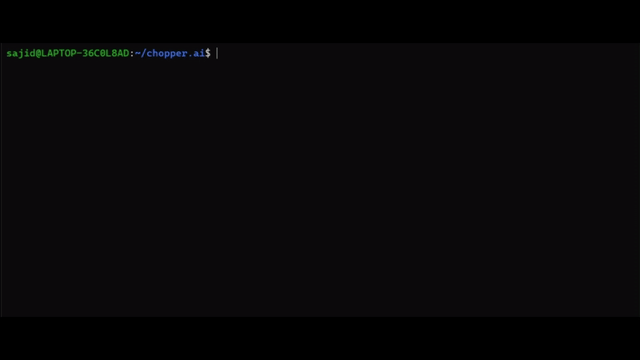
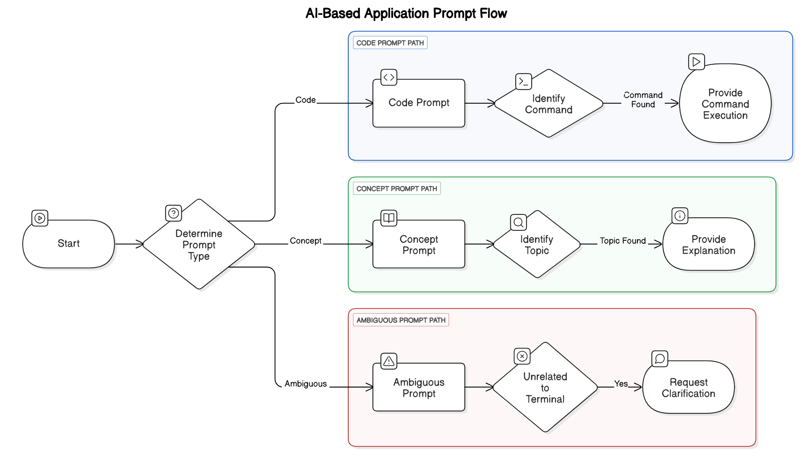

# Chopper AI - Your Terminal AI Assistant

Welcome to Chopper AI, a powerful AI assistant for your linux terminal! 🚀


## 🤔 Why use Chopper AI?

_"Why bother with Chopper AI when you could just type `man` or `--help` like a true Linux guru?"_  
Well... because **Chopper AI** is like having a supercharged, AI-powered buddy right inside your terminal — minus the smug attitude. 😎

### Here's why you should give it a shot:

- 🐧 **Tailored for Linux** — Designed specifically for the Linux terminal (or WSL), it understands your environment natively.
- 💻 **Terminal Command Assistance** — Whether it's obscure commands, tricky flags, or complex bash one-liners, Chopper AI can help you craft or understand them.
- ⚡ **Code Auto-Execution** — Not just suggestions, Chopper AI can directly execute commands for you (with your consent, of course).
- 🔄 **Customizable** — Easily adaptable to your favorite models, prompts, and workflows.
- 🔐 **Secure** — Your API keys are encrypted using Fernet and stored safely on your machine.
- 🧩 **Extensible** — Modular design makes it easy to extend and add new features.

In short:  
It's like `man`, `--help`, and StackOverflow had a terminal-native AI baby... and it listens to you.

## Prerequisites

Before installing Chopper AI, ensure that you have the following dependencies set up:

- **Linux OS or WSL**
- **Python 3.7+**  
  Chopper AI requires Python 3.7 or later. You can check your version using:  
  ```sh
  python3 --version
  ```
- **Pipx**
  ```sh
  pip install --user pipx
  pipx ensure path
  ```
  Restart your linux terminal after you install pipx for the first time


## 🔧 Installation

To install Chopper AI, follow these steps:
```
# Clone the repository
git clone https://github.com/sajid-31/chopper.ai.git
cd chopper.ai

# Run the setup script
chmod +x install.sh
./install.sh
```
 - Chopper.ai will ask for an API KEY
 - Create a free API KEY at [https://openrouter.ai/settings/keys](https://openrouter.ai/settings/keys) and paste it in the terminal
 - Chopper.ai uses [Fernet Module](https://github.com/pyca/cryptography/blob/main/src/cryptography/fernet.py) to encrypt and decrypt your API Keys and saves it locally.
 - Currently, Chopper.ai uses the [Deepseek-r1: Free Model](https://openrouter.ai/deepseek/deepseek-r1:free)

**What the setup does:**

- Installs Chopper AI globally using pipx.
- Runs the initial configuration (config.py) to set up API keys.
- Provides a quick overview of Chopper AI's features.

**🎮 Usage**

Once installed, you can start Chopper AI by running:
```
chopper-cli
```
## Features:

✅ Integrates with various LLM APIs (OpenRouter, OpenAI, DeepSeek, etc.)\
✅ Securely encrypts & stores API keys locally\
✅ Simple CLI interface: just type chopper to begin!

## ❌ Uninstallation

To remove Chopper AI completely, run the following code in chopper.ai directory:
```
chmod +x uninstall.sh
./uninstall.sh
```
What the uninstall script does:
- Uninstalls Chopper AI from pipx.
- Removes configuration files (config.json, key.key).
- Clears Chopper AI from system paths.

## 🔄 Exiting Chopper AI

To exit the assistant, you can:

**Press CTRL + C**
## 🧩 Prompt Types in Chopper AI

Chopper AI handles prompts smartly by categorizing them into three types:

Chopper AI is designed to make sure you don't just get "answers" but get the **right kind** of help depending on what you need!



## 🏗️ Roadmap (Future Features)

Planned enhancements for future releases:  

- ✅ **Multi-turn conversation support** – Keep context between messages.  
- ✅ **User-configurable settings** – Modify API keys and preferences via CLI.  
- ✅ **Better error handling & debugging** – Improve reliability and logging.  
- ✅ **Shell Awareness** – Maintaining shell history to debug commands.  

🚀 Stay tuned for more updates!

## 🛠️ Contributing

Feel free to open issues and pull requests! 😊\
I also welcome any **constructive criticism** on Chopper AI's design. If you have **good design principles** that can improve the project, I'd love to hear your thoughts!  
